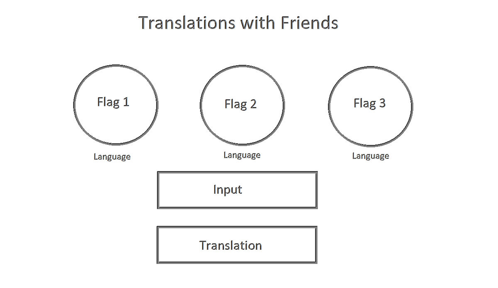

README.md# 

Translation-Application

Pitch:
Translation-Application is an interactive website that allows simple translations at the push of a button.

As a user I want to be able to recieve a translation of my text in one of three different languages dependent on the flag I choose.

WireFrame

Resources:
Google Translate API via RapidAPI

/* If you want to use inspect this code or use the application
git clone via terminal, 
type 'code .' to see code, 
type 'explorer.exe index.html'
(Windows only instructions)*\